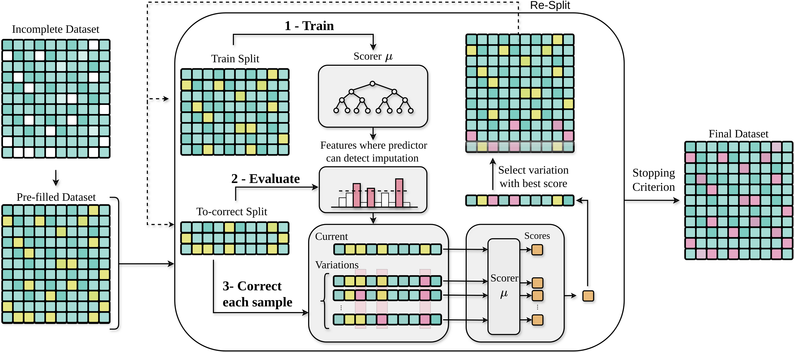

# Miami: Missingness Imputation via Adversarial Multichoice Iterations

Miami is a **lightweight, generator-free framework for distribution-aware imputation of tabular data**. It combines boosted-tree scoring with candidate completions drawn from observed values, requiring no encoder, decoder or learned neural generator. Its simple architecture brings adversarial imputation to tabular datasets through a single `fit_transform(X)` call.

Miami iteratively selects completions that a learned scorer finds less detectably imputed. This targets **distributional fidelity**, helping preserve the variability and feature relationships that matter for downstream analysis, while keeping every observed value unchanged. Two complementary variants are available: **Mask** detects imputation at the feature level, and **Regressor** estimates each row's imputation fraction.

Miami handles **numerical and categorical features**, accepts NumPy arrays, pandas DataFrames and lists of rows, and performs conversion internally. Both variants run on **CPU or NVIDIA GPU**, with configurable iteration and candidate budgets.

<p align="center">
  
</p>

### Install

Miami is accessed through Python. Install the package directly from GitHub:

```bash
pip install "git+https://github.com/AI-sandbox/miami.git"
```

Python 3.10 or later is required. CPU is the default; GPU execution requires an NVIDIA GPU and a compatible CUDA-enabled XGBoost installation.

### Quick Start

Pass your incomplete dataset `X` to `fit_transform`. Missing entries can be `np.nan`, `None` or `pd.NA`.

```python
import numpy as np
from MiamiImputer import MIAMIImputer

X = np.array([
    [1.0, np.nan, 3.0],
    [2.0, 4.0, np.nan],
    [np.nan, 5.0, 6.0],
    [4.0, 6.0, 7.0],
])

# CPU
X_imputed = MIAMIImputer(device="cpu").fit_transform(X)

# GPU
X_imputed = MIAMIImputer(device="cuda:0").fit_transform(X)
```

Pandas tables can contain numerical and categorical columns together:

```python
import pandas as pd

X = pd.DataFrame({
    "age": [25, None, 40, 32],
    "city": ["Barcelona", "Girona", None, "Barcelona"],
})

X_imputed = MIAMIImputer().fit_transform(X)
```

DataFrames retain their index and columns; arrays and lists return a NumPy array. Text, boolean and pandas categorical columns are detected automatically, and category labels are restored in the output. For categories stored as numeric codes, use `categorical_features=["column"]` or column indices for arrays. Each categorical column needs at least one observed value.

### Imputation Modes

Two variants are available through `mode`:

- `"mask"` (default): predicts which features appear imputed.
- `"regressor"`: predicts the fraction of imputed features in each row.

```python
X_imputed = MIAMIImputer(mode="mask", device="cpu").fit_transform(X)
X_imputed = MIAMIImputer(mode="regressor", device="cpu").fit_transform(X)
```

Set `device="cuda:0"` to use either variant on GPU.

### Hyperparameters

Hyperparameters are organized into four groups:

| Group | Controls | Main parameters |
|---|---|---|
| `general` | Iteration budget and when to accept a correction. | `max_iter` (50), `test_size` (0.2), `improvement_threshold` (0.1), `column_auc_threshold` (0.6, Mask) or `r2_threshold` (0.3, Regressor). |
| `generator` | Initialization and the candidate completions considered for each row. | `n_neighbors` (1), `n_codebook` (10,000), `n_exact_copy` (10,000), `n_features_to_mutate` (`"all"`). |
| `discriminator` | Capacity of the model used to score candidates. | `n_estimators` (500), `max_depth` (7 for Mask / 6 for Regressor), `learning_rate` (0.01 / 0.1). |
| `knee` | Automatic stopping based on the scoring model's progress. | `use_knee` (`True`), `knee_savgol_window_length` (25), `knee_savgol_polyorder` (4), `knee_S` (3), `knee_min_points` (5). |

Common parameters can be passed directly, such as `MIAMIImputer(max_iter=20)`, or through their group:

```python
imputer = MIAMIImputer(
    mode="mask",
    device="cpu",
    general={"max_iter": 20},
    generator={"n_codebook": 256, "n_exact_copy": 256},
    discriminator={"n_estimators": 200},
    knee={"use_knee": True},
)
X_imputed = imputer.fit_transform(X)
```

Grouped settings override the corresponding direct arguments. `device`, `n_jobs`, `batch_size`, `random_state` and `categorical_features` are also available as direct arguments.

> [!TIP]
> For a quicker first run, reduce `max_iter`, `n_codebook` and `n_exact_copy`. The example above uses a smaller budget than the defaults.

See the [paper](PAPER_URL) for the method and experimental details.

### License

The software is available under the [MIT license](LICENSE).
